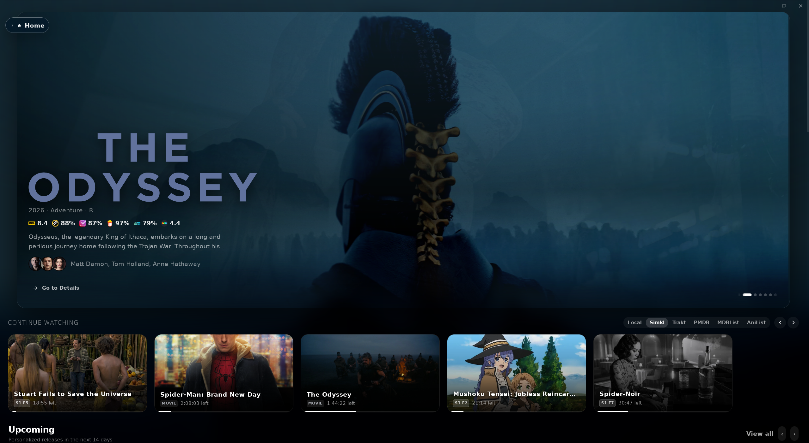
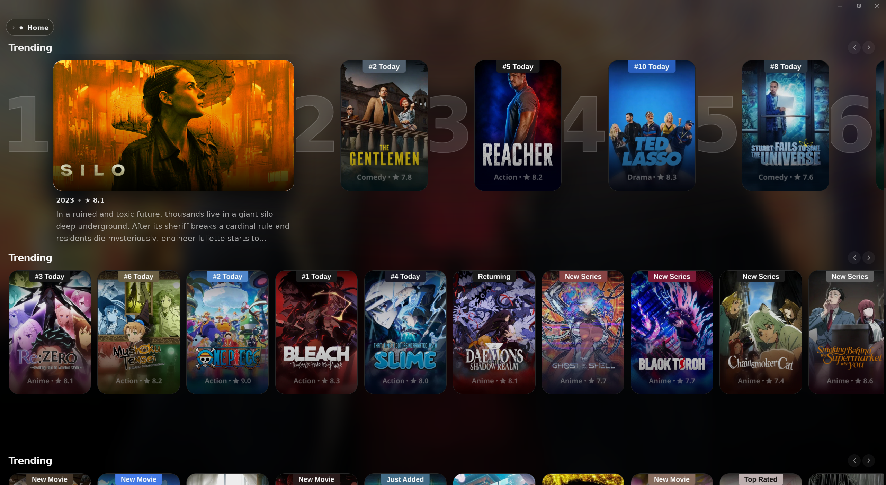
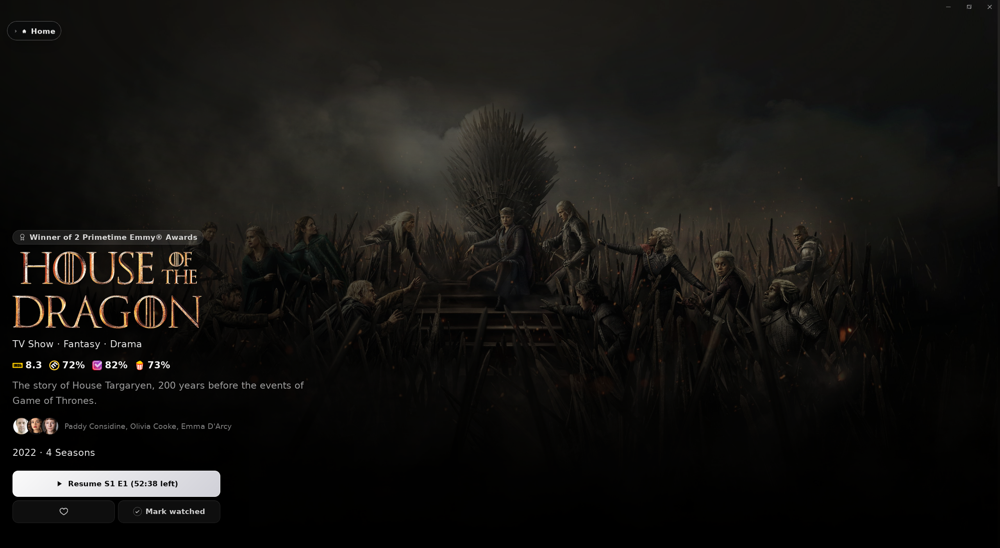
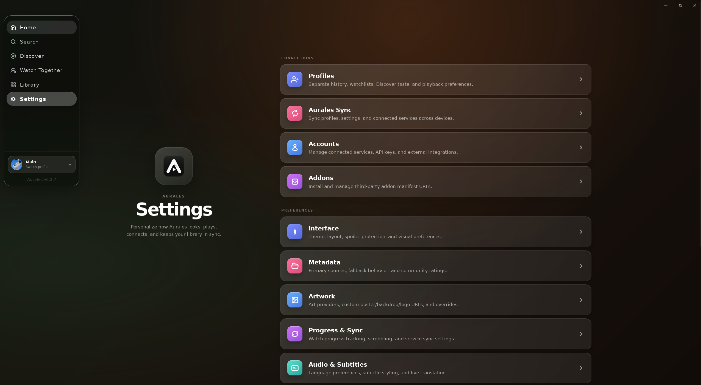
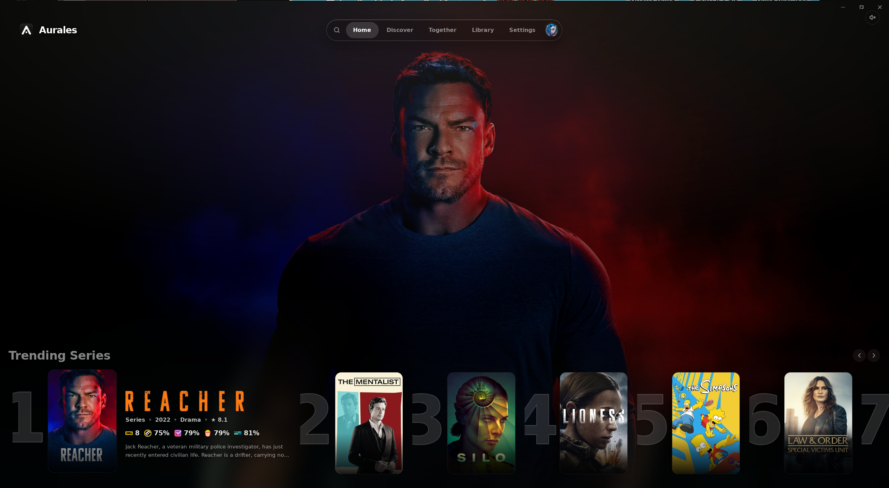
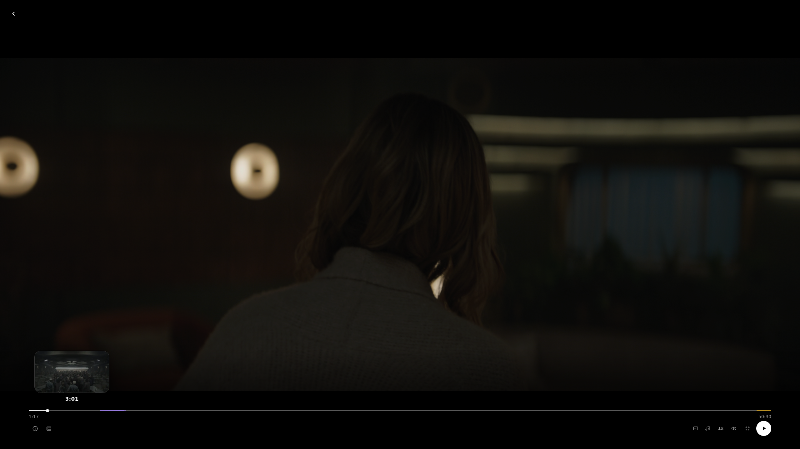

<p align="center">
  
</p>

<h1 align="center">Aurales</h1>

<p align="center">
  A modern, high-performance desktop streaming catalog app with multi-provider watch tracking sync, mood-based discovery, Stremio addon support, and native mpv playback.
</p>

<p align="center">
  
  
  
  
  
  
</p>

---

Aurales is an elegant, offline-first desktop media hub that brings your catalogs, watch history, recommendations, and playback into one focused desktop experience.

## Features at a glance

Aurales is built for people who want a polished place to decide what to watch and keep their viewing history consistent:

| Find something | Watch it | Keep it organized |
| :--- | :--- | :--- |
| Browse Home, Trending, Upcoming, and Discover. Search movies, series, anime, and addon catalogs. | Choose a stream, resume playback, use subtitles, and play videos with embedded or native **mpv**. | Use profiles, local watchlists, custom shelves, provider lists, and optional sync across devices. |

### See it in action

<p align="center">
  
  
</p>

<p align="center">
  
  
</p>

<p align="center">
  
  
</p>

<p align="center">
  
</p>

### Why Aurales

- **One place to browse** — Bring metadata, lists, recommendations, and playback together in one desktop app.
- **Flexible discovery** — Browse by mood, genre, type, rating, streaming service, or personal taste.
- **A full desktop player** — Resume videos, choose streams, skip intros and credits, and customize subtitles.
- **Separate profiles** — Keep each person’s history, lists, recommendations, and playback settings separate.

## Features

### 🔍 Discovery & Search
- **Home, Trending, and Upcoming** — See spotlight titles, continue watching, popular picks, and upcoming releases.
- **Discover** — Browse Movies, Series, and Anime by mood, genre, rating, and recommendation mode.
- **Search sources** — Choose from TMDB, TheTVDB, Trakt, MDBList, TVmaze, Cinemeta, or MAL/Jikan. Installed addon catalogs can appear in search too.
- **Optional AI search** — Connect OpenRouter to search with natural-language requests.

### 🎬 Streaming & Playback
- **Stremio addons** — Install addon URLs to add streams, catalogs, metadata, and subtitles.
- **Stream picker** — Compare available streams and see details such as quality, codec, audio, and file size when provided.
- **mpv playback** — Use the embedded player or a native mpv window with hardware acceleration.
- **Resume and skip** — Resume from saved positions and skip intros, recaps, and credits when IntroDB data is available.
- **Playback tools** — Use timeline previews, stream health checks, subtitle tracks, and configurable player controls.

### 🔄 Watch Tracking & Sync
- **Connected services** — Link Trakt, Simkl, AniList, MDBList, or PMDB.
- **Progress and scrobbling** — Save watched status, resume positions, and playback activity to the services you enable.
- **Lists and ratings** — Browse connected watchlists, account lists, public lists, and ratings where the provider supports them.
- **Provider controls** — Choose which services are used for watched checkmarks, resume data, and scrobbling.
- **Aurales Sync** — Optionally sync profiles, settings, and connected services across devices.

### 📂 Library & Home layout
- **Custom shelves** — Add addon catalogs, provider lists, local watchlists, upcoming releases, and smart collections to Home.
- **Drag and drop** — Reorder shelves and choose poster, landscape, compact, or continue-watching layouts.
- **Collections** — Build dynamic TMDB collections with filters such as genre, rating, and streaming service.
- **Profiles** — Keep library choices and viewing preferences separate for each profile.

### 💬 Watch Together
- **Shared rooms** — Create or join a room with an invite link.
- **Synchronized playback** — Play, pause, and seek together while each person uses their own stream.
- **Room chat** — Send messages and show chat bubbles during playback.

### 🌟 Anime
- **Dedicated Anime tab** — Keep anime separate from regular Movies and Series browsing.
- **Episode tracking** — Track episodes and progress with AniList, Simkl, Trakt, or local storage.
- **Cross-provider matching** — Match anime across MAL, AniList, TMDB, TheTVDB, and other metadata sources.
- **Season support** — Handle regular seasons, specials, OVAs, and unaired episodes.

### 🛠️ Subtitles & AI translation
- **Multiple subtitle sources** — Use embedded tracks, addon subtitles, or external SRT files.
- **Subtitle styling** — Change size, color, background, outline, position, and other display options.
- **Optional live translation** — Use an OpenRouter model to translate the active subtitle track while you watch.

## Download & Install

Download version **0.3.7** from the [GitHub Releases](https://github.com/Febsho/Aurales/releases) page.

### Version 0.3.7 highlights

- Anime details, artwork, episode descriptions, ratings, and season changes now
  resolve faster with more reliable cross-provider matching and caching.
- Timeline previews now build progressively in the background and update live
  while scrubbing, without seeking until the timeline is actively dragged.
- Cold start and everyday navigation use less eager work, defer heavyweight
  player and sync modules, and pause unnecessary updates while the app is hidden.
- Sidebar and Watch Together interactions have smoother motion, clearer icons,
  and more consistent room and playback behavior.

### Windows

Download and run the NSIS setup file ending in `-setup.exe` (recommended). The `.msi` installer remains available for managed or enterprise installations.

### Linux

Aurales publishes two Linux downloads for x86-64 systems:

- **Flatpak bundle** — recommended for the most consistent installation across distributions.
- **AppImage** — portable and does not need a traditional installation.

#### Flatpak (all distributions)

Install Flatpak first if it is not already available:

**Ubuntu / Debian**

```bash
sudo apt update
sudo apt install flatpak curl
```

**Fedora**

```bash
sudo dnf install flatpak curl
```

**Arch Linux / EndeavourOS / Manjaro**

```bash
sudo pacman -S flatpak curl
```

**openSUSE**

```bash
sudo zypper install flatpak curl
```

Download and install Aurales directly from GitHub:

```bash
curl -fL \
  https://github.com/Febsho/Aurales/releases/download/v0.3.7/Aurales_0.3.7_amd64.flatpak \
  -o Aurales_0.3.7_amd64.flatpak
flatpak install --user -y ./Aurales_0.3.7_amd64.flatpak
flatpak run com.aurales.app
```

To update, run the download and `flatpak install --user` commands again with the new version number.

#### AppImage

The AppImage includes **mpv, libmpv, FFmpeg, and yt-dlp**. No system media
packages are required. If it reports that FUSE is missing, install `libfuse2`
on Debian and older Ubuntu releases, `libfuse2t64` on current Ubuntu releases,
`fuse-libs` on Fedora, or `fuse2` on Arch-based distributions.

Download Aurales directly from GitHub, install it for your user, and launch it:

```bash
mkdir -p ~/.local/bin
curl -fL \
  https://github.com/Febsho/Aurales/releases/download/v0.3.7/Aurales_0.3.7_amd64.AppImage \
  -o ~/.local/bin/aurales
chmod +x ~/.local/bin/aurales
~/.local/bin/aurales
```

To update the AppImage, run the `curl` command again with the new version number.

AppImage and Flatpak provide broad Linux coverage without publishing a separate package for every distribution. Native `.deb`, `.rpm`, Snap, and AUR packages can be added later if there is demand for package-manager integration.

---

## Tech Stack

| Layer | Technology |
| :--- | :--- |
| **Desktop Framework** | [Tauri 2](https://v2.tauri.app/) (Rust + TypeScript) |
| **Frontend UI** | React 19, Tailwind CSS 4, Zustand 5, React Router 7 |
| **Build System** | Vite 8, TypeScript |
| **Media Player** | Native mpv + libmpv FFI (bundled in Windows, AppImage, and Flatpak releases) |
| **Database & Cache** | SQLite (via rusqlite, static/bundled build) |

---

## Application Paths & Troubleshooting

- **App Database & Settings Cache**:
  - Windows: `%APPDATA%/com.aurales.app/`
  - Linux: `~/.local/share/com.aurales.app/`
- **Player Debug Logs**:
  - Located in `player_debug.log` at the root of the app directory during development. Helpful if you encounter subtitle rendering or video decoding issues.
- **Build Logs**:
  - `tauri-build.stdout.log` and `tauri-build.stderr.log` contain outputs from compiler stages.

---

## Building from Source

Requirements:

- Node.js LTS and npm
- Rust stable
- Tauri 2 system dependencies for your platform
- Linux: WebKitGTK 4.1 development packages, mpv/libmpv, FFmpeg, and the standard GTK build toolchain

```bash
npm ci
npm run build
npm run tauri build
```

Linux release bundles can be built with:

```bash
npm run tauri build -- --config src-tauri/tauri.linux.conf.json
```

Tagged releases are created by pushing a tag such as `v0.3.7`. The release workflow keeps the existing Windows NSIS/MSI outputs and publishes only AppImage and Flatpak for Linux. The Debian package produced in CI is an internal Flatpak assembly input and is not uploaded.

---

## License

This project is licensed under the [MIT License](./LICENSE) - see the file for details.
