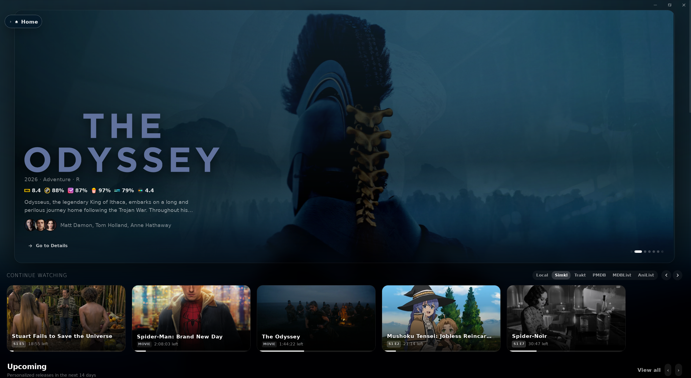
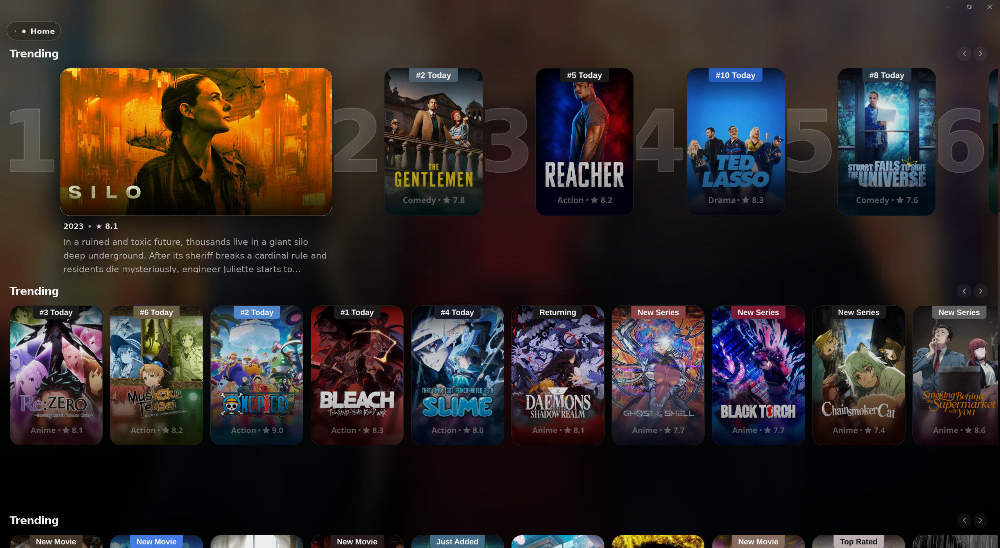
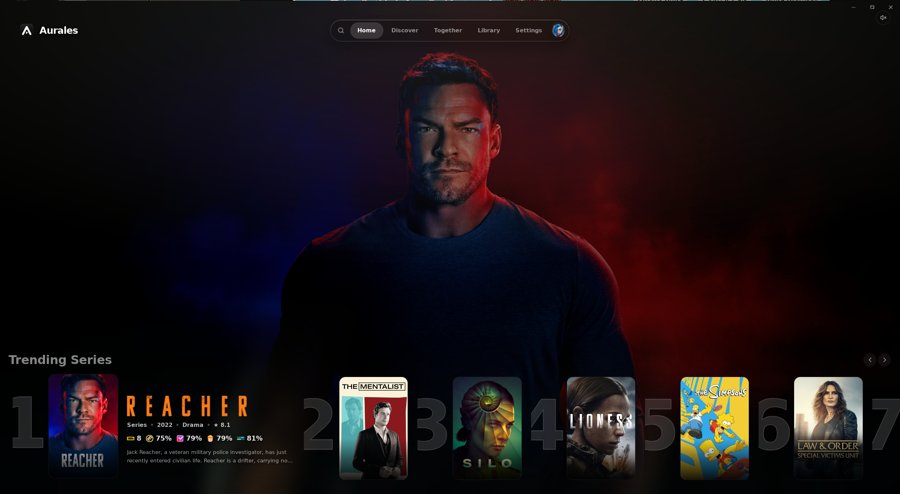
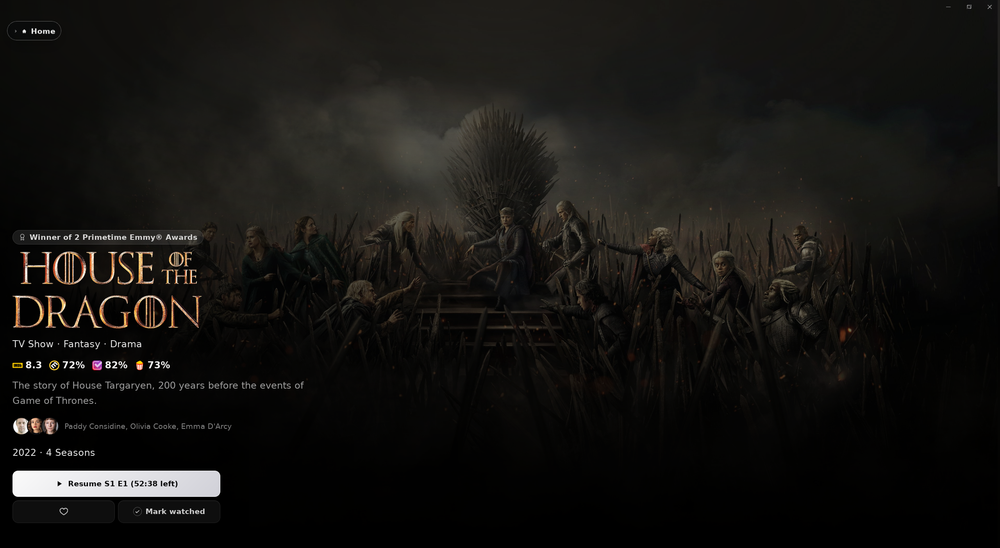
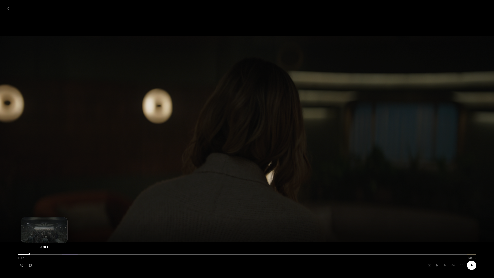
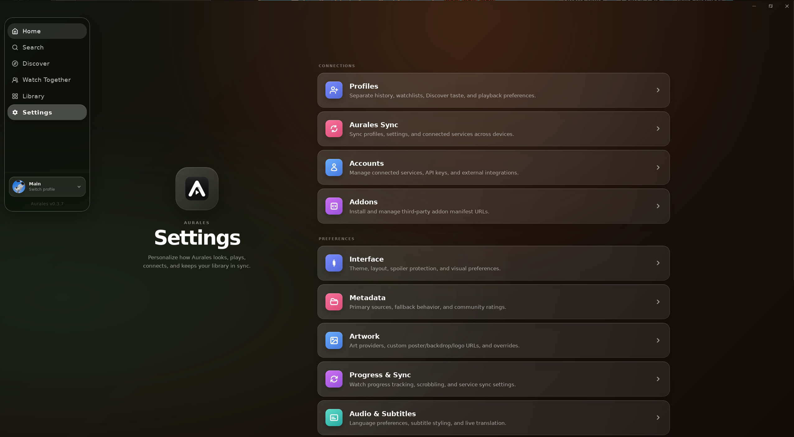

<p align="center">
  
</p>

<h1 align="center">Aurales</h1>

<p align="center">
  <strong>A modern desktop media hub for discovery, streaming, watch tracking and native playback.</strong>
</p>

<p align="center">
  Browse movies, series and anime, connect your services, install Stremio addons and play everything through a powerful native mpv player.
</p>

<p align="center">
  <a href="https://github.com/Febsho/Aurales/releases/latest">
    
  </a>
</p>

<p align="center">
  
  
  
  
  
  
  
</p>

<br>

<p align="center">
  
</p>

<p align="center">
  <em>Your movies, shows, anime, watch history, recommendations and playback in one place.</em>
</p>

---

## What is Aurales?

Aurales is a desktop media application built around a simple idea:

**finding something to watch, playing it and keeping track of it should happen in one app.**

It combines metadata, discovery, watch tracking, Stremio-compatible addons, connected services and native media playback into a fast desktop experience for Windows and Linux.

Aurales is designed to feel like a dedicated streaming application rather than a browser wrapped around several services.

---

## Everything in one place

<table>
<tr>
<td width="33%" align="center">

### Discover

Movies, series and anime from multiple metadata providers, recommendation engines, catalogs and connected services.

</td>
<td width="33%" align="center">

### Watch

Choose a stream and play through native **mpv** with hardware acceleration, subtitles and advanced playback controls.

</td>
<td width="33%" align="center">

### Sync

Keep progress, history, watchlists and watched states connected across your tracking services.

</td>
</tr>
</table>

---

# Discover what to watch

<p align="center">
  
</p>

Aurales combines several ways of discovering content instead of forcing everything into one recommendation source.

Browse:

* Home
* Trending
* Upcoming releases
* Movies
* Series
* Anime
* Provider catalogs
* Stremio addon catalogs
* Personal lists
* Smart collections

Discover can filter titles using characteristics such as:

* Genre
* Mood
* Rating
* Release year
* Runtime
* Streaming service
* Media type
* Personal taste

Search can use metadata from sources including:

**TMDB · TheTVDB · Trakt · MDBList · TVmaze · Cinemeta · MAL / Jikan**

Installed addon catalogs can also participate in search.

### Optional AI Search

Connect OpenRouter and search using natural language.

For example:

```text
dark sci-fi movies from the last 10 years
```

or:

```text
something similar to Severance but more mysterious
```

---

# A cinematic Home experience

<p align="center">
  
</p>

Home is built from configurable shelves rather than a fixed catalog.

Shelves can include:

* Continue Watching
* Trending
* Upcoming releases
* Local watchlists
* Provider lists
* Stremio addon catalogs
* Smart collections
* Custom content sources

Shelves can be reordered and displayed using different layouts including:

* Poster
* Landscape
* Compact
* Continue Watching

Aurales keeps already-loaded Home content available during the session so normal navigation does not constantly destroy and reload the interface.

---

# Rich title pages

<p align="center">
  
</p>

Title pages bring together the information needed before pressing Play.

Depending on available metadata, Aurales can show:

* Synopsis
* Ratings
* Runtime
* Genres
* Release information
* Cast
* Seasons
* Episodes
* Watch state
* Playback progress
* Connected-service status
* Available streams
* Related metadata

Recently resolved details are cached during the session for faster repeat visits.

Artwork also uses persistent caching and optional **Better Posters** resolution to improve repeat loading and visual quality.

---

# Series & Anime

<p align="center">
  
</p>

Series and anime receive dedicated season and episode handling.

Aurales supports:

* Season browsing
* Episode progress
* Watched indicators
* Resume state
* Specials
* OVAs
* Unaired episodes
* Provider-specific anime structures

Anime can be matched across services including:

**AniList · MyAnimeList · TMDB · TheTVDB · SIMKL · Trakt**

Aurales normalizes these different metadata structures so the same anime does not have to behave like a completely different title depending on the provider.

---

# Native mpv playback

<p align="center">
  
</p>

Aurales uses **mpv / libmpv** for native media playback rather than relying on browser video playback.

The player supports:

* Hardware accelerated decoding
* High-quality video playback
* Multiple audio tracks
* Multiple subtitle tracks
* External subtitles
* Embedded subtitles
* Resume playback
* Playback progress
* Stream fallback
* Stream health tracking
* Timeline previews
* Intro skipping
* Recap skipping
* Credit skipping
* Configurable subtitle styling

Aurales can use an embedded player or native mpv playback depending on platform and configuration.

### Fast track switching

Audio and subtitle preferences can automatically prioritize your preferred languages, while track switching is designed to happen without restarting normal playback.

### Playback recovery

Aurales includes recovery mechanisms for problematic streams and playback states, including stream fallback and player recovery when video output fails.

---

# Stremio addon support

Aurales supports Stremio-compatible addons.

Install addon manifest URLs to provide:

* Streams
* Catalogs
* Metadata
* Subtitles

Multiple providers can contribute streams for the same title.

Aurales can then rank available sources and present them through its stream selector.

Where available, stream information can include:

* Resolution
* Codec
* HDR
* Audio
* Source
* File size
* Provider

You always retain the ability to manually choose a source.

---

# Watch tracking

Connect the services you already use:

| Service          | Watch state | History / Scrobbling | Lists | Progress |
| ---------------- | :---------: | :------------------: | :---: | :------: |
| **Trakt**        |      ✓      |           ✓          |   ✓   |     ✓    |
| **SIMKL**        |      ✓      |           ✓          |   ✓   |     ✓    |
| **AniList**      |      ✓      |           ✓          |   ✓   |     ✓    |
| **MDBList**      |      ✓      |           ✓          |   ✓   |     ✓    |
| **PublicMetaDB** |      ✓      |           ✓          |   ✓   |     ✓    |

Availability depends on the capabilities exposed by each provider.

Aurales can use connected services for:

* Continue Watching
* Watched checkmarks
* Episode progress
* Movie progress
* Playback scrobbling
* Watchlists
* Ratings
* Provider lists

You can control which connected service acts as the primary source for watch information.

---

# Profiles

Aurales supports separate local profiles.

Each profile can keep its own:

* Watch history
* Watchlists
* Continue Watching
* Recommendations
* Home shelves
* Connected services
* Playback preferences
* Subtitle preferences
* Language preferences
* Interface settings

This allows multiple people to use the same installation without mixing their viewing data.

---

# Aurales Sync

Aurales can optionally synchronize supported profile data between devices.

This can include:

* Profiles
* Settings
* Connected-service configuration
* Viewing state
* Application preferences

Local use does not require Aurales Sync.

---

# Watch Together

Aurales includes synchronized remote viewing.

Create a room or join using an invite link.

Each participant can use their own stream while Aurales synchronizes:

* Play
* Pause
* Seeking
* Playback position

Rooms also support chat during playback.

---

# Subtitles

Aurales supports subtitles from:

* Embedded tracks
* Stremio addons
* External subtitle files

Subtitle appearance can be customized with options such as:

* Size
* Position
* Font weight
* Italic
* Outline
* Shadow
* Background
* Color

### Optional AI translation

An OpenRouter model can optionally translate the active subtitle track during playback.

---

# Settings without configuration files

<p align="center">
  
</p>

Most functionality can be configured directly from the application.

Settings include areas for:

* Profiles
* Connected accounts
* Sync
* Stremio addons
* Servers
* Playback
* Subtitles
* Languages
* Appearance
* Metadata
* Images
* Cache
* Keyboard shortcuts
* Updates

---

# Performance

Aurales combines a React interface with increasingly coarse native Rust operations for expensive work.

The goal is not to move UI code into Rust unnecessarily.

Instead, Rust handles work that benefits from being outside the presentation layer, including areas such as:

```text
Providers
Metadata
Anime mapping
Caching
Streams
Stream ranking
Synchronization
SQLite
Image handling
mpv integration
```

while React remains responsible for:

```text
UI
Navigation
Presentation
Interaction
View state
```

This keeps the interface flexible while reducing expensive cross-process and provider work.

More information is available in [`RUST_CORE_ARCHITECTURE.md`](./RUST_CORE_ARCHITECTURE.md).

---

# Download

The latest release is:

## Aurales v0.4.8

**[Download from GitHub Releases](https://github.com/Febsho/Aurales/releases/latest)**

Available for:

| Platform | Package          |
| -------- | ---------------- |
| Windows  | `.exe` installer |
| Windows  | `.msi`           |
| Linux    | `.AppImage`      |
| Linux    | `.flatpak`       |

---

## Windows

The recommended Windows package is the NSIS installer:

```text
Aurales_0.4.8_x64-setup.exe
```

The MSI package is also available for managed installations.

---

## Linux

### Flatpak

Download:

```text
Aurales_0.4.8_amd64.flatpak
```

Install:

```bash
flatpak install --user ./Aurales_0.4.8_amd64.flatpak
```

Run:

```bash
flatpak run com.aurales.app
```

### AppImage

Download:

```text
Aurales_0.4.8_amd64.AppImage
```

Make it executable:

```bash
chmod +x Aurales_0.4.8_amd64.AppImage
```

Run:

```bash
./Aurales_0.4.8_amd64.AppImage
```

The AppImage bundles the required media components including:

* mpv
* libmpv
* FFmpeg
* yt-dlp

so separate media packages are normally unnecessary.

---


# v0.4.8

Version 0.4.8 improves the native player when switching between Aurales and other Windows applications.

* Keep the transparent player window below the active app and remove the Windows caption that can reappear after Alt-Tab.
* Use available Seekr sprite previews for scrubbing and chapter cards without competing thumbnail requests against playback.
* Make the next-episode action more compact in both player modes.

See the full release notes on the **[v0.4.8 release page](https://github.com/Febsho/Aurales/releases/tag/v0.4.8)**.

---

# v0.4.7

Version 0.4.7 fixes Home shelves that jump to the end when more than fifteen entries are available.

* Give every card its own horizontal snap point so the final "Show all" tile cannot pull the entire row to the right edge.
* Reset scroll positions saved by the faulty snapping behavior once, while retaining normal shelf position restoration thereafter.

See the full release notes on the **[v0.4.7 release page](https://github.com/Febsho/Aurales/releases/tag/v0.4.7)**.

---

# v0.4.6

Version 0.4.6 fixes Home row scrolling and SIMKL sync storage.

* Keep identically named shelves from sharing a scroll position and render enough cards for scrolling on wide windows.
* Move the SIMKL library snapshot and activity cursor to SQLite, migrating saved data without dropping it when storage is full.
* Show a new SIMKL last-sync time only after a successful sync.

See the full release notes on the **[v0.4.6 release page](https://github.com/Febsho/Aurales/releases/tag/v0.4.6)**.

---

# v0.4.5

Version 0.4.5 improves playback continuity, personalized discovery, and session restoration.

* Add next-episode controls to native and in-app playback, with automatic stream lookup for the following episode.
* Improve recommendations using watched-title cast, director, and runtime details; hidden genres can be managed independently.
* Apply discovery feedback immediately to saved recommendations and include local watchlist activity.
* Restore home shelves and route scroll positions more reliably after startup or navigation.
* Improve player and stream-selection behavior, plus sync handling for local progress.

See the full release notes on the **[v0.4.5 release page](https://github.com/Febsho/Aurales/releases/tag/v0.4.5)**.

---

# v0.4.4

Version 0.4.4 improves account connection feedback and watched indicators.

* Keep SIMKL browser authorization tied to one pending callback, preventing repeated Connect clicks from replacing the active login attempt.
* Clear stale SIMKL warning text after connecting and clarify the browser callback confirmation.
* Simplify Trakt setup by removing the custom Client ID and Client Secret fields.
* Make watched checkmarks easier to see on media posters.

See the full release notes on the **[v0.4.4 release page](https://github.com/Febsho/Aurales/releases/tag/v0.4.4)**.

---

# v0.4.3

Version 0.4.3 clarifies SIMKL AUTH V2 setup for the local browser callback.

* Document the SIMKL client redirect URI to register without a port.
* Explain that Aurales uses its configured loopback port to receive the OAuth callback and exchange the authorization code.

See the full release notes on the **[v0.4.3 release page](https://github.com/Febsho/Aurales/releases/tag/v0.4.3)**.

---

# v0.4.2

Version 0.4.2 improves playback discovery, watch progress, and SIMKL account connectivity.

* Rank streams by playback compatibility and quality, with compact filters and clearer source details.
* Combine connected services in Continue Watching while preserving provider-specific watch actions and locally cached progress.
* Show watch progress and completion state consistently on poster cards and detail pages.
* Add SIMKL AUTH V2 token exchange and refresh support for the updated authentication flow.

See the full release notes on the **[v0.4.2 release page](https://github.com/Febsho/Aurales/releases/tag/v0.4.2)**.

---

# v0.4.1

Version 0.4.1 updates the SIMKL connection to the current two-phase sync model.

* First connection imports shows, movies, and anime sequentially, then saves
  the SIMKL activity cursor.
* Later refreshes check activity first and merge only the changed library
  slice, including episode watch-state updates.
* SIMKL refreshes no longer use unconditional background polling or redundant
  full-history requests.
* Connected watch-state checks reuse the activity-gated SIMKL snapshot.

See the full release notes on the **[v0.4.1 release page](https://github.com/Febsho/Aurales/releases/tag/v0.4.1)**.

---

# Technology

| Layer       | Technology            |
| ----------- | --------------------- |
| Desktop     | **Tauri 2**           |
| Native Core | **Rust**              |
| UI          | **React 19**          |
| Language    | **TypeScript**        |
| Styling     | **Tailwind CSS 4**    |
| State       | **Zustand 5**         |
| Routing     | **React Router 7**    |
| Build       | **Vite 8**            |
| Database    | **SQLite / rusqlite** |
| Player      | **mpv / libmpv**      |

---

# Building from source

### Requirements

* Node.js
* npm
* Rust stable
* Tauri 2 platform dependencies

On Linux you will additionally need the normal WebKitGTK / GTK development dependencies required by Tauri.

Clone:

```bash
git clone https://github.com/Febsho/Aurales.git
cd Aurales
```

Install dependencies:

```bash
npm ci
```

Run the frontend:

```bash
npm run dev
```

Build:

```bash
npm run build
npm run tauri build
```

Run tests:

```bash
npm test
```

Run linting:

```bash
npm run lint
```

---

# Application data

### Windows

```text
%APPDATA%/com.aurales.app/
```

### Linux

```text
~/.local/share/com.aurales.app/
```

---

# Roadmap

Aurales is actively evolving around four main areas:

**Instant UI**
Persistent shelves, faster details, smoother browsing and a faster artwork pipeline.

**Player**
Faster startup, stronger recovery, better stream selection and near-instant track switching.

**Anime**
Better season structures, faster metadata resolution and seamless season navigation.

**Rust Core**
Continue moving expensive provider, cache, ranking and synchronization operations behind coarse native commands while keeping presentation logic in React.

---

# License

Aurales is released under the [MIT License](./LICENSE).

---

<p align="center">
  
</p>

<p align="center">
  <strong>Find it. Watch it. Keep it synced.</strong>
</p>

<p align="center">
  <a href="https://github.com/Febsho/Aurales/releases/latest">Download</a>
  ·
  <a href="https://github.com/Febsho/Aurales/releases">Releases</a>
  ·
  <a href="https://github.com/Febsho/Aurales/issues">Issues</a>
</p>
